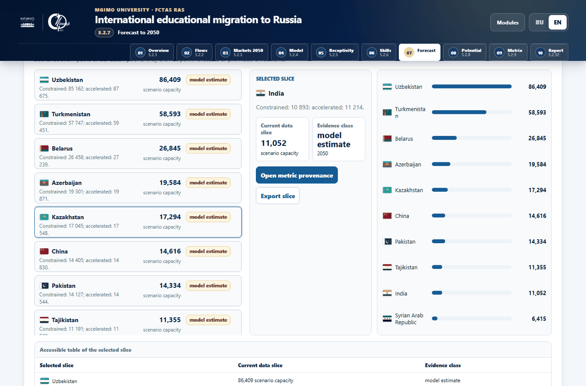
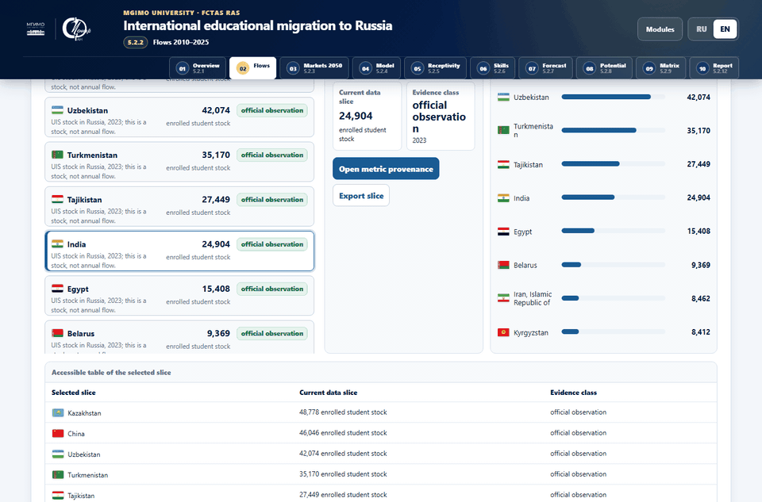
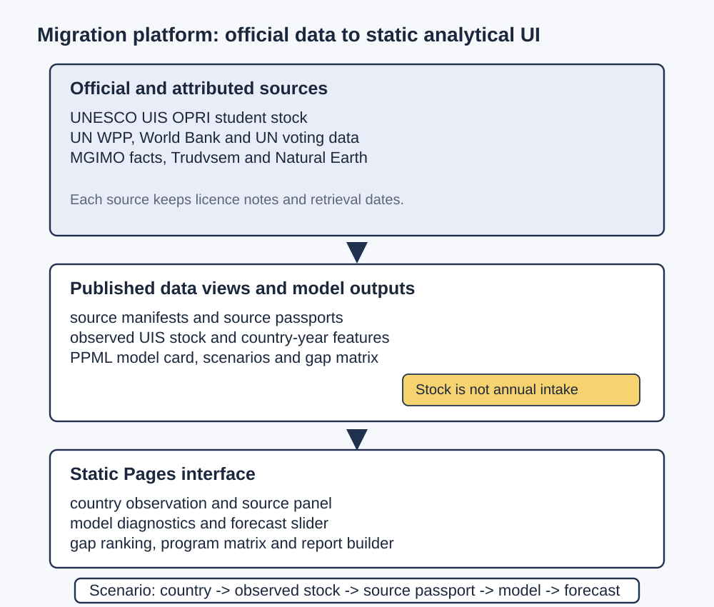
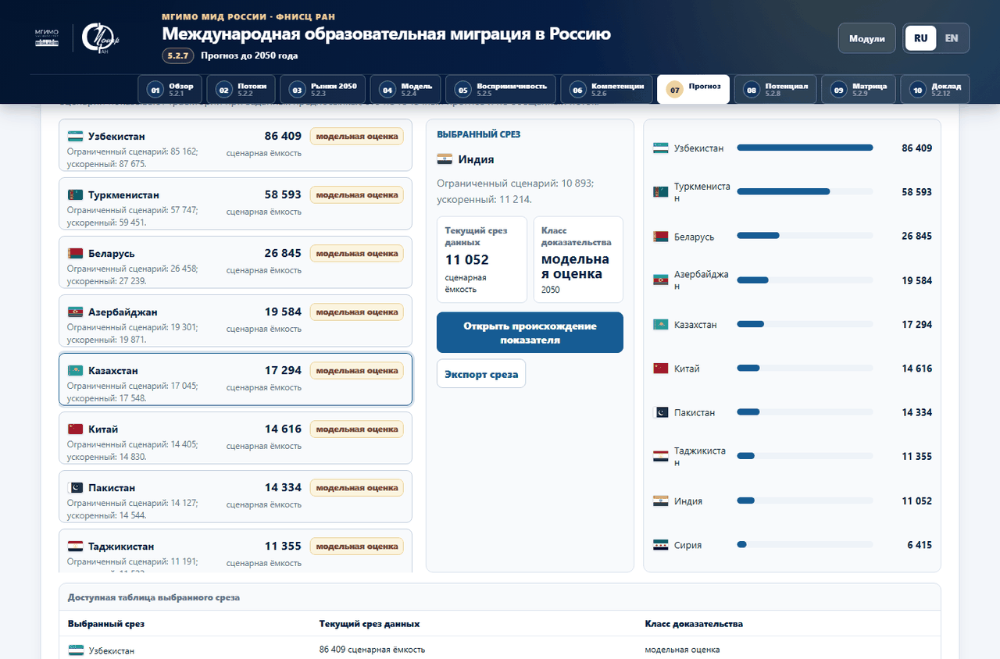
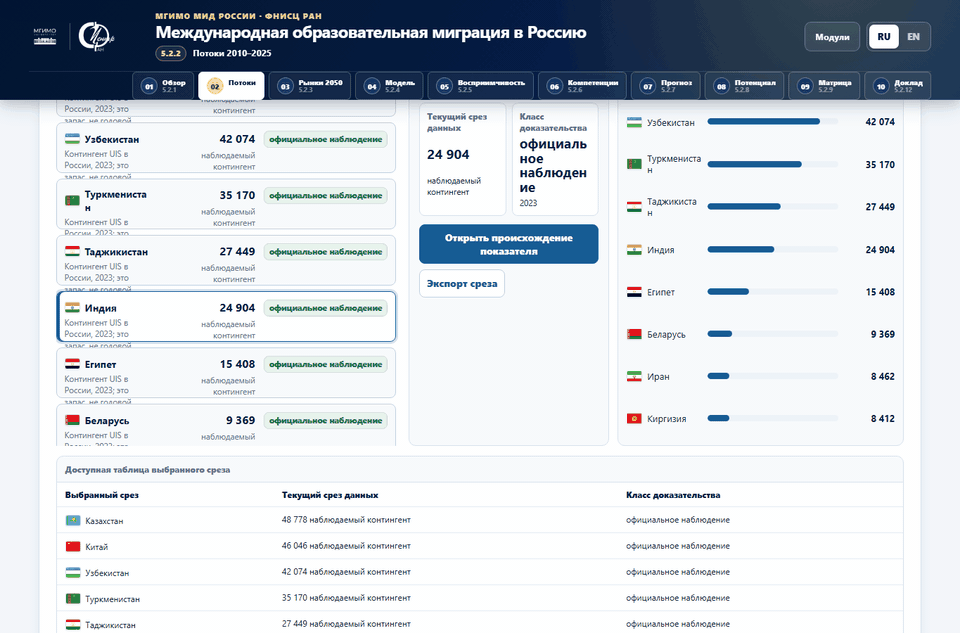
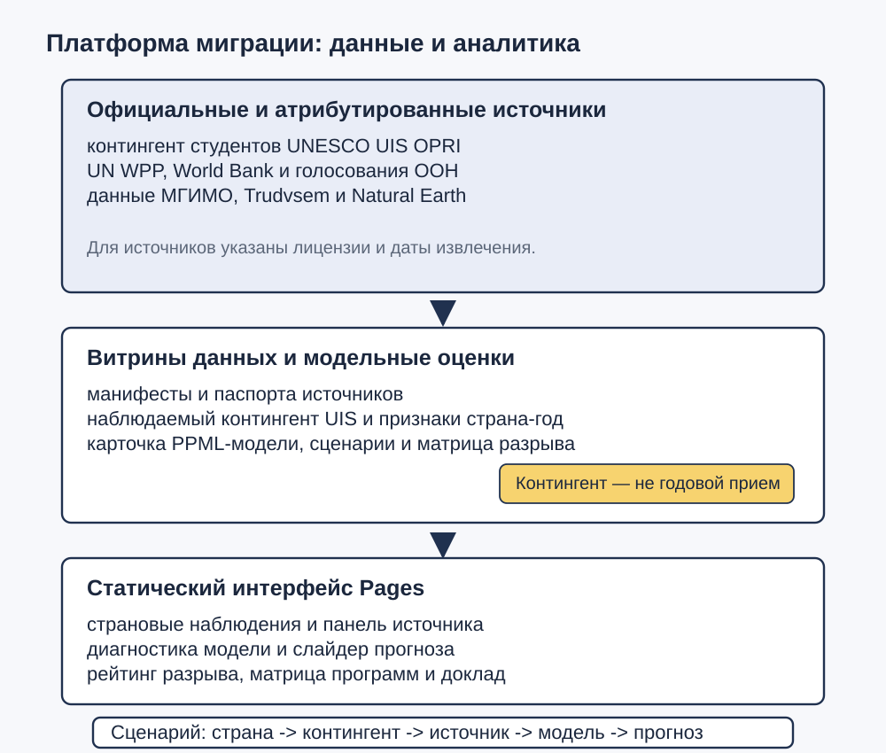

# International educational migration to Russia

[English](#english) · [Русский](#русский)

Live site: <https://arseniy24rus.github.io/International-educational-migration-to-Russia/>



*The screenshot shows the loaded forecast workbench with country rows, selected slice and scenario values visible.*

## English



*The workflow starts from an observed country state, opens a source passport, then moves to model diagnostics and the forecast scenario panel.*

### What This Repository Contains

This repository is a reproducible static GitHub Pages release for an analytical platform on international educational migration to Russia. The public site is not a database service and does not ship the large raw source archives. It publishes a browser application under [`docs/`](docs/) with ten research pages: overview, observed Russia inbound stock, demographic markets, gravity model, receptivity, vacancies and competencies, forecast, structural gap, decision matrix and executive report composer. The front-end source builder is in [`src/frontend/platform2/`](src/frontend/platform2/), and the generated runtime assets are in [`docs/assets/`](docs/assets/).

The intended audience is a university strategy, international admissions or research-policy team that needs to ask a specific question without mixing evidence classes. A typical scenario is: choose a country on the observed inbound page, verify that the number is an official UNESCO UIS stock of enrolled internationally mobile students in Russia, open the source passport, move to the model card, and then compare that observation with a scenario forecast or structural under-representation estimate. The UI is bilingual; English and Russian screenshots are captured from the actual `/docs` app.

### Capabilities And Data Products

The platform combines public UI artifacts in [`docs/data/`](docs/data/) with small reproducibility metadata in [`configs/`](configs/), [`schemas/`](schemas/), [`data/source_registry.yaml`](data/source_registry.yaml) and [`data/source_manifest_platform2.json`](data/source_manifest_platform2.json). The canonical public payload is [`docs/data/mgimo_platform2_payload.json`](docs/data/mgimo_platform2_payload.json). UI-specific marts live in [`docs/data/platform2/ui/`](docs/data/platform2/ui/), while the public source manifest and failed-attempt registry are in [`docs/data/platform2/source_manifest_platform2.json`](docs/data/platform2/source_manifest_platform2.json).

The site renders country rows, flags, source panels, model diagnostics, scenario sliders, gap rankings, program-matrix rows and a report preview. It keeps official observations, official projections, calculated values, model estimates and management indices visibly separate. The source panel exposes period, unit, evidence class, transform script, checksum and trace/source key where the published UI data provides them. The release QA script in [`scripts/run_github_pages_release_qa.cjs`](scripts/run_github_pages_release_qa.cjs) checks all ten pages, source panels, flags, blank charts/maps, layout overflow and the English executive report path.



### Methodology And Guardrails

The central methodological constraint is documented in [`docs/DATA_DICTIONARY_PLATFORM2.md`](docs/DATA_DICTIONARY_PLATFORM2.md) and [`docs/METHODOLOGY_PLATFORM2.md`](docs/METHODOLOGY_PLATFORM2.md): `students_observed` is an observed UNESCO UIS OPRI stock of enrolled foreign students, not a count of new annual entrants. The repository deliberately preserves the `flow_or_stock` field so users do not interpret a stock ranking as a flow ranking.

The structural model is a Poisson pseudo-maximum-likelihood allocation model with origin-clustered covariance, trained over 2011-2023 according to [`docs/METHODOLOGY_PLATFORM2.md`](docs/METHODOLOGY_PLATFORM2.md). Its status is `validated_structural_model_not_short_term_point_forecast`: it is used for structural capacity, under-representation and uncertainty, not for causal effects or a guaranteed short-term enrolment forecast. The forecast page separates scenario trajectories from a demographic-continuity benchmark; the gap page compares the latest meaningful actual UIS stock with model-based capacity and reports uncertainty rather than adding model output to observed facts.

Vacancy and competency data from the official Trudvsem API are also guarded. The public snapshot is sanitized; overlapping query totals are diagnostic signals, not a unique vacancy count, and the program demand score is a relative index. The country-program matrix is an uncertainty-aware management priority index. It does not claim an identified recruitment effect before a prospective campaign evaluation.

### Run Locally And Existing Checks

```bash
npm ci
npx playwright install --with-deps
npm run frontend:public:release
```

The clean Pages artifact is written to `release/github-pages`. On Windows, the generated local opener is:

```bat
release\github-pages\open_github_pages_local.cmd
```

To validate a deployed site:

```bash
node scripts/run_github_pages_release_qa.cjs --engine chromium --base-url https://arseniy24rus.github.io/International-educational-migration-to-Russia
node scripts/run_github_pages_release_qa.cjs --engine webkit --base-url https://arseniy24rus.github.io/International-educational-migration-to-Russia
```

The package scripts are listed in [`package.json`](package.json). They build public artifacts, validate the release and run Playwright QA.

### Licensing And Attribution

No top-level `LICENSE` file is present, so repository-level reuse is not broadly licensed by default. Source-specific terms are recorded in the manifests. UNESCO UIS rows are attributed as CC BY-SA 4.0 in the source manifest; World Bank indicators follow World Bank Dataset Terms, defaulting to CC BY 4.0 unless a particular indicator says otherwise; Natural Earth is public domain. UN WPP, UN Digital Library, MGIMO public materials and Trudvsem-derived records are released as attributed research derivatives with advisory notes that upstream terms remain controlling.

<details>
<summary>Preserved quick map of old README sections</summary>

- `docs/` contains source HTML and runtime assets.
- `docs/data/` contains public data artifacts and UI marts.
- `src/frontend/platform2/` contains the public front-end source builder.
- `scripts/` contains deterministic release and validation scripts.
- Large raw archives, source API snapshots, intermediate datasets, local worklogs and QA screenshots are intentionally excluded from ordinary Git blobs.

</details>

## Русский



*Скриншот показывает загруженную сценарную лабораторию: видны страновые строки, выбранный срез и значения прогноза.*



*Сценарий начинается с выбранной страны на странице наблюдений, открывает паспорт источника, затем переходит к диагностике модели и прогнозу.*

### Что находится в репозитории

Этот репозиторий — воспроизводимый статический выпуск GitHub Pages для аналитической платформы о международной образовательной миграции в Россию. Это не сервер базы данных и не хранилище крупных исходных выгрузок. Публичный сайт находится в [`docs/`](docs/) и включает десять исследовательских страниц: обзор, наблюдаемый контингент иностранных студентов в России, демографические рынки, гравитационную модель, восприимчивость стран, вакансии и компетенции, прогноз, структурный разрыв, матрицу решений и конструктор аналитического отчета. Исходники браузерной части находятся в [`src/frontend/platform2/`](src/frontend/platform2/), а сгенерированные файлы для работы сайта — в [`docs/assets/`](docs/assets/).

Главный пользователь — команда университетской стратегии, международного приема или исследовательской политики, которой нужно быстро проверить страновую гипотезу и не смешать разные типы данных. Типовой сценарий: выбрать страну на странице наблюдений, убедиться, что число является официальным контингентом UNESCO UIS OPRI по уже зачисленным иностранным студентам в России, открыть паспорт источника, перейти к карточке модели и сравнить наблюдение со сценарным прогнозом или оценкой структурной недопредставленности. Интерфейс двуязычный; русские и английские скриншоты получены из реального приложения в `docs`.

### Возможности и опубликованные данные

Платформа соединяет опубликованные данные интерфейса в [`docs/data/`](docs/data/) с воспроизводимой метаинформацией в [`configs/`](configs/), [`schemas/`](schemas/), [`data/source_registry.yaml`](data/source_registry.yaml) и [`data/source_manifest_platform2.json`](data/source_manifest_platform2.json). Канонический публичный набор для браузера — [`docs/data/mgimo_platform2_payload.json`](docs/data/mgimo_platform2_payload.json). Отдельные витрины данных для интерфейса лежат в [`docs/data/platform2/ui/`](docs/data/platform2/ui/), а публичный манифест источников и реестр неудачных попыток извлечения — в [`docs/data/platform2/source_manifest_platform2.json`](docs/data/platform2/source_manifest_platform2.json).

Сайт показывает страновые строки, флаги, панели источников, диагностику модели, сценарные слайдеры, рейтинг структурного разрыва, матрицу стран и программ, а также предварительный просмотр аналитического отчета. Официальные наблюдения, официальные демографические проекции, расчетные показатели, модельные оценки и управленческие индексы разделены в интерфейсе и не подаются как один ряд фактов. Панель источника раскрывает период, единицу измерения, `evidence_class`, `transform_script`, `checksum` и ключ трассировки там, где эти поля есть в опубликованной витрине данных. Скрипт [`scripts/run_github_pages_release_qa.cjs`](scripts/run_github_pages_release_qa.cjs) проверяет десять страниц, панели источников, флаги, непустые графики и карты, отсутствие переполнения верстки и английский сценарий аналитического отчета.



### Методология и ограничения

Ключевое методологическое ограничение описано в [`docs/DATA_DICTIONARY_PLATFORM2.md`](docs/DATA_DICTIONARY_PLATFORM2.md) и [`docs/METHODOLOGY_PLATFORM2.md`](docs/METHODOLOGY_PLATFORM2.md): `students_observed` — это наблюдаемый контингент зачисленных иностранных студентов по UNESCO UIS OPRI, а не число новых поступивших за год. Поле `flow_or_stock` специально сохранено, чтобы пользователь не прочитал ранжирование контингентов как ранжирование годового приема.

Структурная модель оценивается методом Poisson pseudo-maximum likelihood; ковариационная матрица кластеризована по странам происхождения. Согласно [`docs/METHODOLOGY_PLATFORM2.md`](docs/METHODOLOGY_PLATFORM2.md), обучение выполнено на данных 2011-2023 годов. Статус модели — `validated_structural_model_not_short_term_point_forecast`: она нужна для оценки структурной емкости, недопредставленности и неопределенности, но не доказывает причинные эффекты и не является гарантированным краткосрочным прогнозом набора. Страница прогноза отделяет сценарные траектории от инерционно-демографического ориентира; страница разрыва сопоставляет последний содержательный факт UIS с модельной оценкой емкости и показывает неопределенность, не складывая наблюдения и модельные оценки в один показатель.

Данные по вакансиям и компетенциям из официального API Trudvsem также ограничены по интерпретации. Публичный срез обезличен; пересекающиеся результаты поисковых запросов служат диагностическими признаками и не суммируются в число уникальных вакансий. Индекс спроса на программы является относительным показателем. Матрица стран и программ показывает приоритеты с учетом неопределенности и не утверждает, что приемная кампания уже оказала измеренный эффект; для такого вывода нужна отдельная перспективная оценка кампании.

### Локальный запуск и существующие проверки

```bash
npm ci
npx playwright install --with-deps
npm run frontend:public:release
```

Чистый каталог для GitHub Pages создается в `release/github-pages`. На Windows локальная команда открытия:

```bat
release\github-pages\open_github_pages_local.cmd
```

Проверка опубликованного сайта:

```bash
node scripts/run_github_pages_release_qa.cjs --engine chromium --base-url https://arseniy24rus.github.io/International-educational-migration-to-Russia
node scripts/run_github_pages_release_qa.cjs --engine webkit --base-url https://arseniy24rus.github.io/International-educational-migration-to-Russia
```

Скрипты перечислены в [`package.json`](package.json): они собирают публичный каталог, валидируют выпуск и запускают проверки Playwright.

### Лицензии и атрибуция

В корне нет файла `LICENSE`, поэтому репозиторий по умолчанию не выдает общей открытой лицензии на повторное использование. Условия по источникам зафиксированы в манифестах. Строки UNESCO UIS атрибутированы как CC BY-SA 4.0; показатели World Bank следуют World Bank Dataset Terms и по умолчанию CC BY 4.0, если конкретный показатель не указывает иное; Natural Earth относится к общественному достоянию. UN WPP, UN Digital Library, публичные материалы МГИМО и производные записи Trudvsem опубликованы как атрибутированные исследовательские производные; условия исходных источников остаются определяющими.

<details>
<summary>Краткая карта разделов старого README</summary>

- `docs/` содержит HTML-страницы и файлы, нужные публичному сайту во время работы.
- `docs/data/` содержит опубликованные данные и витрины для интерфейса.
- `src/frontend/platform2/` содержит исходники сборки браузерной части.
- `scripts/` содержит детерминированную сборку выпуска и проверочные сценарии.
- Крупные исходные архивы, снимки API, промежуточные наборы данных, локальные рабочие журналы и скриншоты проверок намеренно не хранятся как обычные Git-объекты.

</details>
